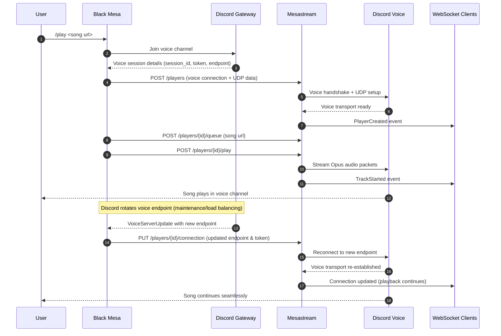

# mesastream

mesastream is the audio streaming service intended for use by black mesa. controlled by a http api, mesastream handles Discord voice transport and audio streaming.

## with Docker

```bash
docker build -f mesastream/Dockerfile -t mesastream:local .
```

start the container with:

```bash
docker run --rm \
	--name mesastream \
	-p 8070:8070 \
	-e AUTH_TOKEN="replace_with_secure_bearer_token" \
	-e REDIS_URI="redis://host.docker.internal:6379" \
	-e OTLP_ENDPOINT="http://host.docker.internal:4318/v1/traces" \
	-v "$(pwd)/mesastream/cache:/var/cache/mesastream/audio" \
	mesastream:local
```

## api spec

openapi spec is available in this repository at `openapi.yaml`.

## connection flow



## env vars

| Variable | Required | Default | Description |
| --- | --- | --- | --- |
| `AUTH_TOKEN` | Yes | N/A | Bearer token required by all authenticated API routes. |
| `REDIS_URI` | Yes | N/A | Redis connection string for player state and queue persistence. |
| `OTLP_ENDPOINT` | Yes | N/A | OpenTelemetry OTLP endpoint. |
| `REDIS_PREFIX` | No | `mesastream` | Redis key prefix. |
| `OTLP_AUTH` | No | unset | Authorization header value for OTLP exporter. |
| `OTLP_ORGANIZATION` | No | unset | Optional org/tenant value for telemetry. |
| `PORT` | No | `8080` | HTTP listen port. |
| `YT_DLP_PATH` | No | `yt-dlp` | Path to yt-dlp executable. |
| `YT_DLP_COOKIES` | No | unset | Optional cookies file path for yt-dlp. |
| `FFMPEG_BITRATE_KBPS` | No | `128` | Opus encode bitrate in kbps. |
| `AUDIO_CACHE_PATH` | No | `/var/cache/mesastream/audio` | On-disk audio cache directory. |
| `AUDIO_CACHE_TTL_SECS` | No | `604800` | Cache metadata TTL in seconds. |
| `SOURCE_STREAM_CHANNEL_CAPACITY` | No | `16` | Source stream channel capacity. |
| `CACHE_WRITER_BUFFER_BYTES` | No | `196608` | Cache write buffer size. |
| `CACHE_READER_BUFFER_BYTES` | No | `65536` | Cache read buffer size. |
| `RUST_LOG` | No | logger default | Rust log filter (for example `info,mesastream=debug`). |
